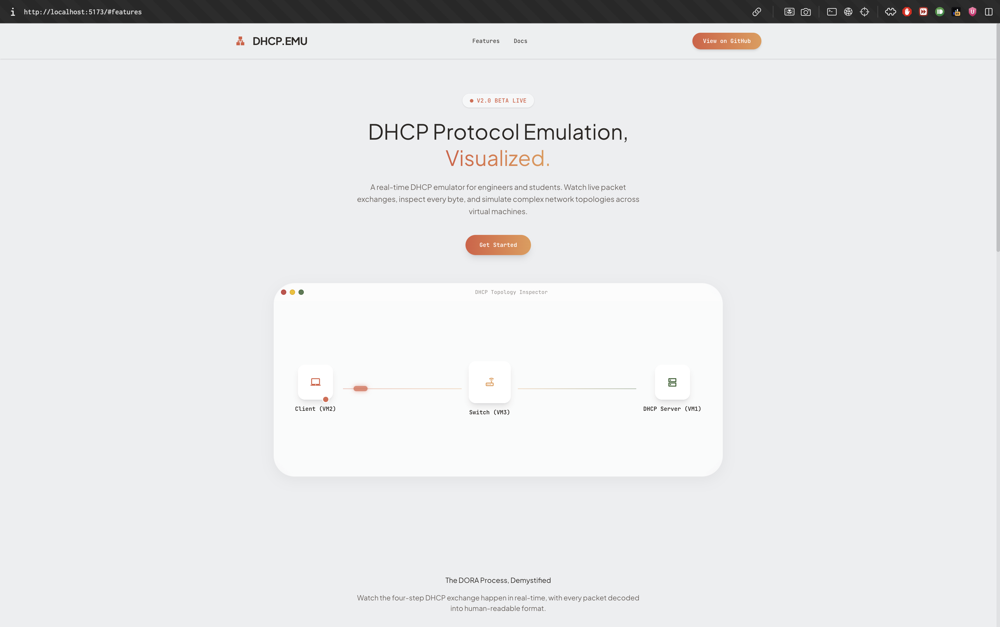
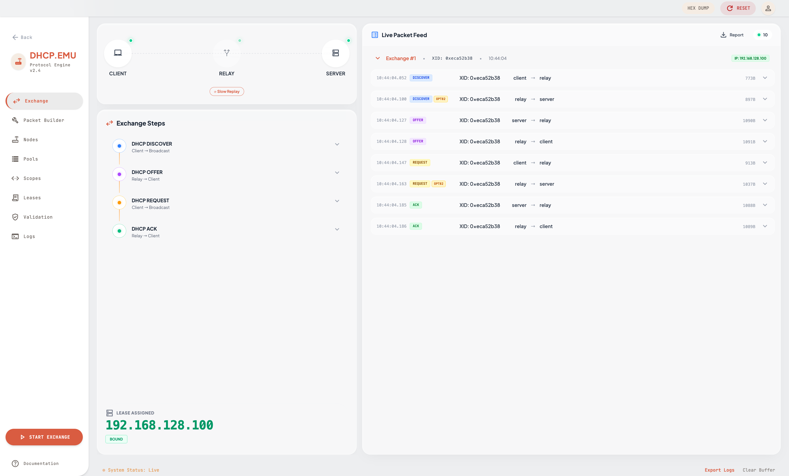
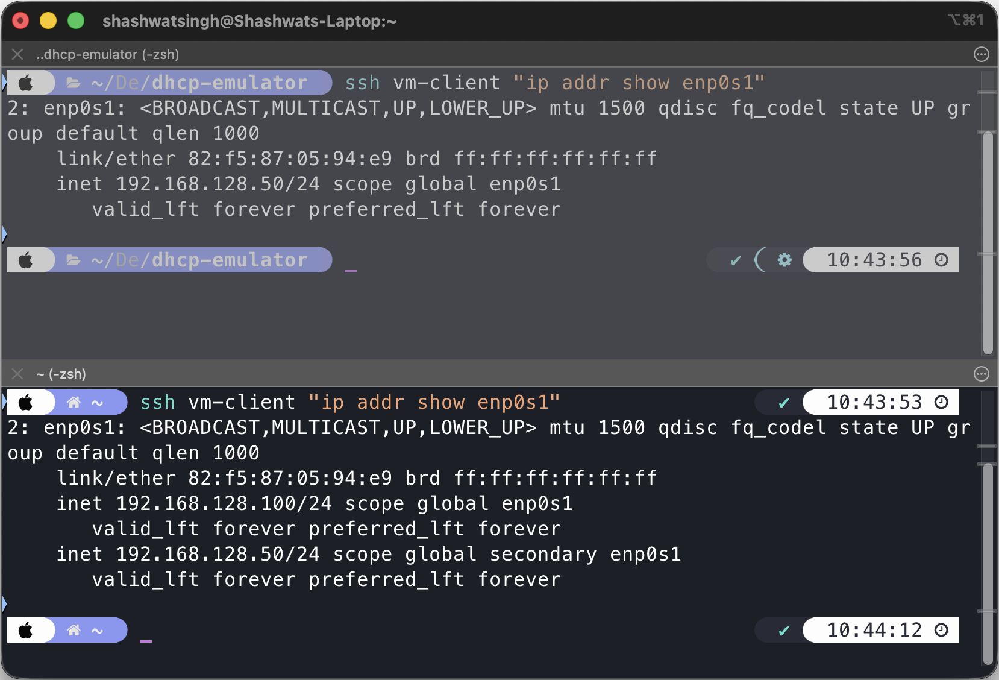
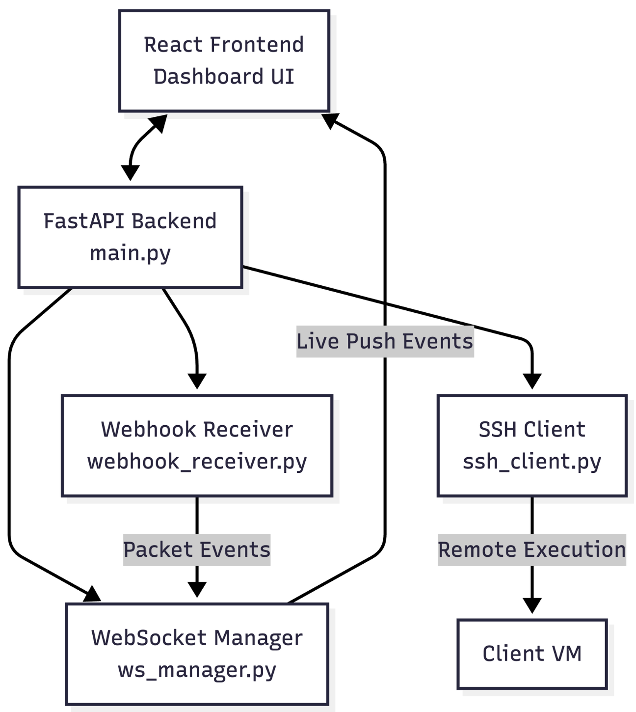
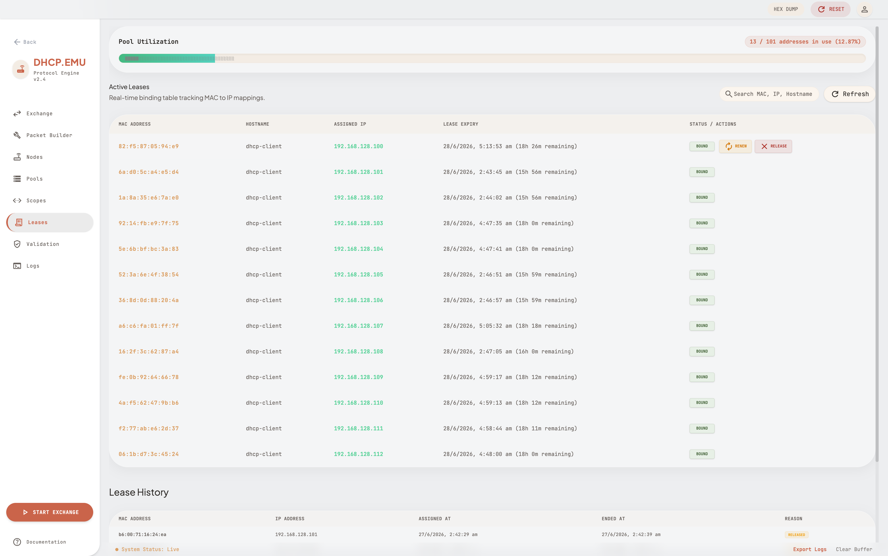
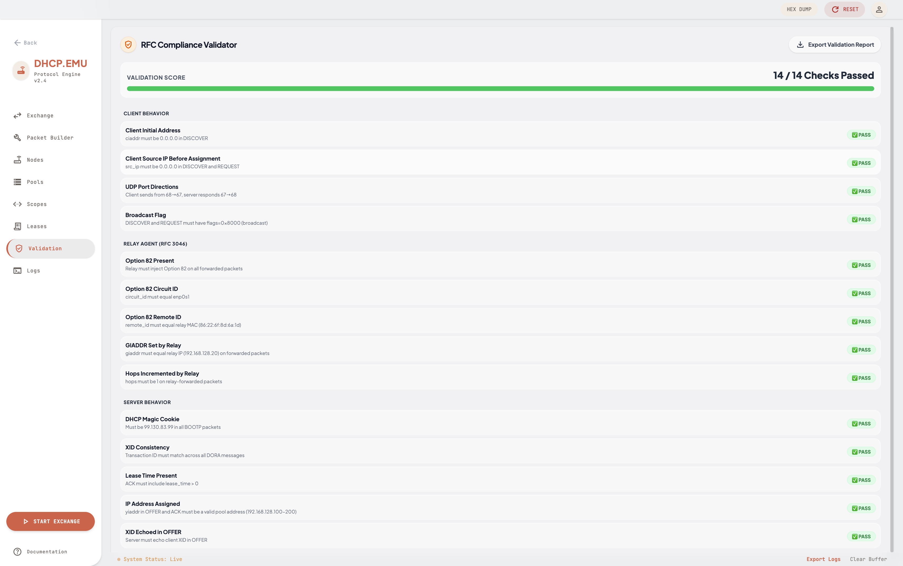
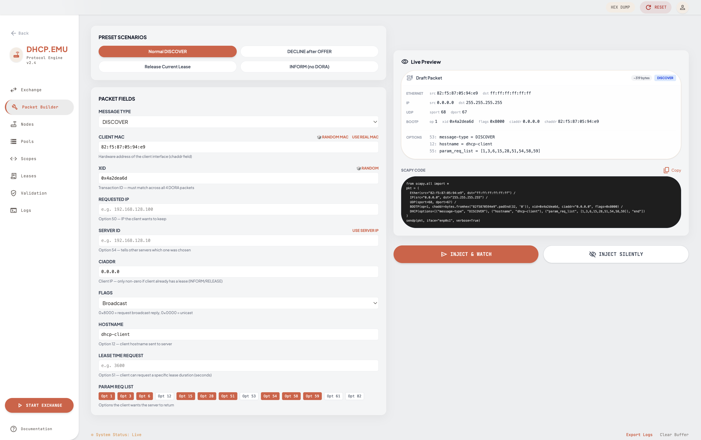
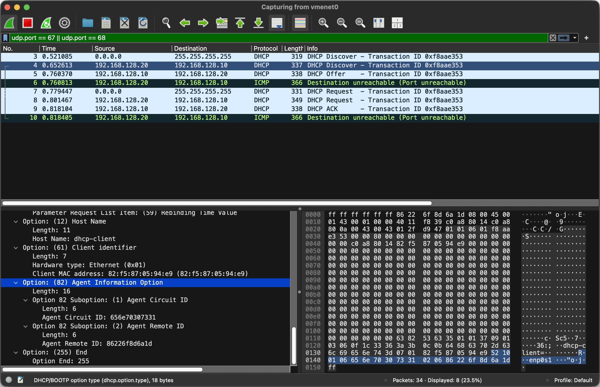

# DHCP.EMU


DHCP.EMU is a full-stack, enterprise-grade DHCP protocol emulator that visualizes real DHCP packet exchanges (DORA process) across virtual machines in real-time. Built for network engineers and protocol enthusiasts, it injects and captures live Layer 2/3 packets on the wire, offering deep packet inspection, RFC compliance validation, and a dynamic WebSocket-driven dashboard.

## 📸 Screenshots

### Landing Page


### Live Dashboard — Real-time DORA Exchange


### Proof of Real IP Assignment (Before vs After)
> Terminal output showing `ip addr show enp0s1` before and after exchange — 192.168.128.100 genuinely assigned by the DHCP server


### System Architecture


### Lease Management


### RFC 2131 Compliance Validation


### Custom Packet Builder


### Wireshark Screenshot


## ✨ Features

- **Real DORA Exchange:** Simulates true DHCP sequences (Discover, Offer, Request, Acknowledge) on live network interfaces.
- **Option 82 Relay Agent:** Includes full support for DHCP Relay Agents injecting Circuit ID and Remote ID.
- **Live Packet Inspector:** Decode raw network packets in real-time with an interactive UI.
- **RFC Validator:** 14 automated compliance checks against RFC 2131, RFC 2132, and RFC 3046.
- **Lease Management:** Real-time tracking of MAC-to-IP bindings, lease expirations, and subnet pools.
- **Packet Builder:** Craft custom malformed or edge-case DHCP payloads directly from the dashboard.
- **Live WebSocket Feed:** Millisecond-accurate event streaming of the complete protocol lifecycle.
- **PCAP Export:** Export any exchange as a `.pcap` file for deep analysis in Wireshark.

## 🏗️ System Architecture

The emulator relies on a 3-VM architecture bridged over a Host-Only network to isolate and inspect raw DHCP broadcast traffic without interfering with external networks.

- **VM1 (DHCP Server - `192.168.128.10`)**: Runs the authoritative server script and manages the `leases.json` database.
- **VM2 (DHCP Client - `192.168.128.50`)**: Receives genuine IP assignments.
- **VM3 (Relay Agent - `192.168.128.20`)**: Intercepts client broadcasts, injects Option 82, and forwards to the server.

The **mac_backend** orchestrates the VMs via SSH (`paramiko`), triggers packet injection using Python `scapy`, and streams the results back to the React UI.

## 🚀 Quick Start

1. Set up the three Ubuntu VMs with the correct static IPs (`enp0s1`).
2. Copy the `.env.example` file to `.env` and fill out your SSH credentials:
   ```bash
   cp .env.example .env
   ```
3. Run the automated deployment script to copy components to their respective VMs:
   ```bash
   ./deploy.sh
   ```
4. Start the backend:
   ```bash
   cd mac_backend
   uvicorn main:app --reload
   ```
5. Start the frontend:
   ```bash
   cd mac_frontend
   npm run dev
   ```

## 🛠️ Tech Stack

| Component | Technology |
|---|---|
| **Frontend** | React 18, Vite, Tailwind CSS v4, Framer Motion |
| **Backend** | Python, FastAPI, Uvicorn, WebSockets |
| **Network Engine**| Scapy, raw sockets, SSH (Paramiko) |
| **Virtualization**| UTM (Ubuntu Server 22.04 VMs) |
